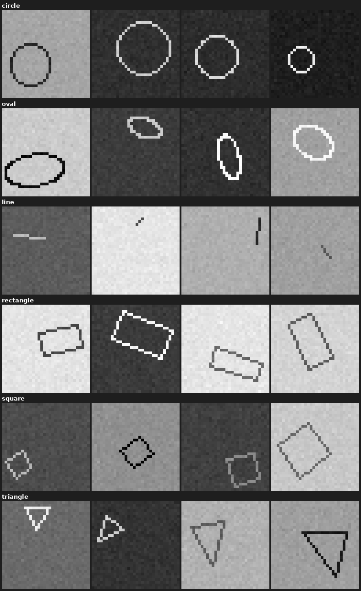

# Shape Classifier

A CNN that classifies 32×32 grayscale images into one of six basic shapes: **circle, oval, line, rectangle, square, triangle**.

## Dataset

Images are synthetically generated (`dataset_generator.py`): each shape is drawn with random size, rotation, and position, on a random grayscale background with a contrasting outline color and light pixel noise added on top. This keeps every sample unique while forcing the model to learn shape rather than color or position.

| Setting | Value |
|---|---|
| Image size | 32 × 32, grayscale |
| Classes | 6 (circle, oval, line, rectangle, square, triangle) |
| Samples per class | 10,000 (60,000 total) |
| Train / validation split | 80% / 20% |

**Sample images (4 per class):**



## Model

A small CNN (`cnn.py`): three convolutional blocks (32 → 64 → 128 channels, each with ReLU + max-pool) followed by a fully connected classifier head with dropout. Trained with Adam, cross-entropy loss, and a `ReduceLROnPlateau` scheduler, checkpointing the best model by validation accuracy.

## Per-Class Validation Accuracy

*Results from `multiclass_test.py` on the held-out validation set:*

| Class | Correct | Total | Accuracy |
|---|---|---|---|
| circle | 1970 | 1970 | 100.00% |
| oval | 2017 | 2019 | 99.90% |
| line | 2028 | 2028 | 100.00% |
| rectangle | 1981 | 2015 | 98.31% |
| square | 1943 | 1951 | 99.59% |
| triangle | 2016 | 2017 | 99.95% |
| **Overall** | 11955 | 12000 | **99.62%** |

*(Best checkpoint at epoch 28.)*

## Usage

```bash
pip install -r requirements-dataset.txt
python dataset_generator.py   # generate shapes_dataset.pt

pip install -r requirements-train.txt
python cnn.py                 # train and save best_model.pt
python multiclass_test.py     # print per-class validation accuracy
```
